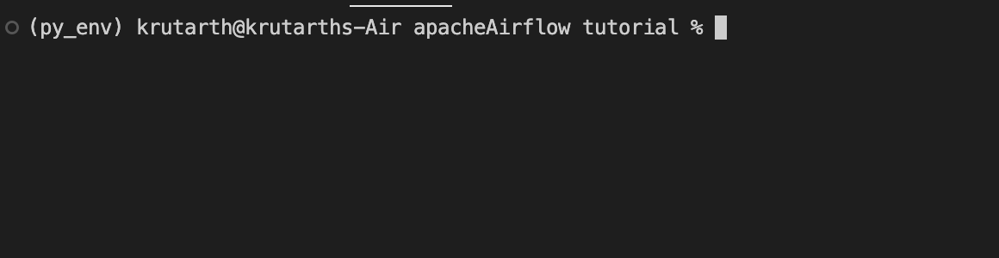
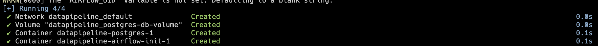
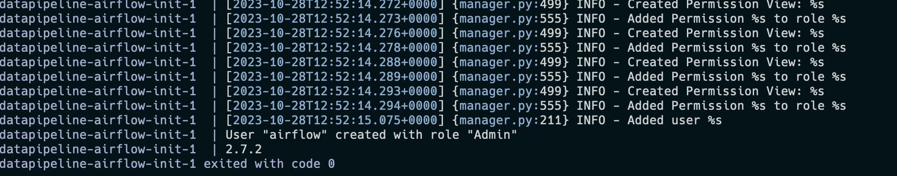
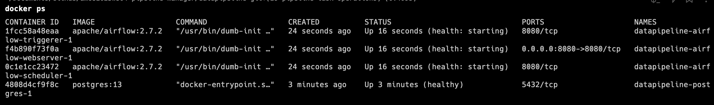
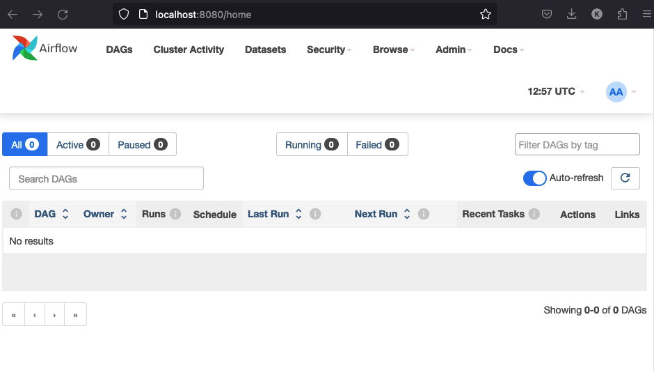
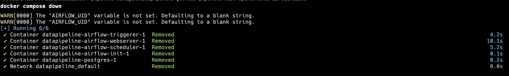

# Data pipeline Apache airflow

Authored by : krutarth 

This document contain in depth commands how to start a apache airflow server

- Method 1 : allows users to setup their own instance of virtual Environment
- Method 2 : with docker, just run two commands and the pipeline is up and running.

### Create DAG task:

To create custom DAG task which should later on appear on Apache airflow dashboard.

- create a python file (_.py) in DAG folder
- The DAG task will appear on the dashboard (if not refresh the page)

### pre-requisite:

- Python
- Make sure python path is properly configured.

### Tested on the version

- pip ~ 23.3.1

[https://medium.com/international-school-of-ai-data-science/setting-up-apache-airflow-in-macos-57ab9e8edb8a](https://medium.com/international-school-of-ai-data-science/setting-up-apache-airflow-in-macos-57ab9e8edb8a)

### Step-by-Step guide

**`sudo pip3 install virtualenv`**

create repos 

mkdir airflow_env

mkdir airflow

**`virtualenv airflow_env`**

**`source airflow_env/bin/activate`**

- **`pip3 install 'apache-airflow[gcp,sentry,statsd]`'**
    - **`cd airflow`**
    - **`airflow db init`**
    - **`mkdir dags`**
- **`airflow users create --username admin --password your_password --firstname your_first_name --lastname your_last_name --role Admin --email your_email@some.com`**
- **`airflow users list`**
- Start the scheduler : **`airflow scheduler` and let it keep running**
- start a new terminal
- **`source airflow_env/bin/activate`**
- **`cd airflow`**
- **`airflow webserver -p <port>` By default 8080**

Visit the website **[http://localhost:8080/](http://localhost:8080/)** 

A dashboard will be available login with the same password and user name you provided.

Apache airflow : https://github.com/apache/airflow

Apache airflow docs: [https://airflow.apache.org/docs/](https://airflow.apache.org/docs/)

virtual environment will look like this 



## Docker initialisation

make sure airflow library is installed 

`pip install apache-airflow` or `pip3`

### Pre-requisite

- Make sure docker is installed on the device, if not take a look at the documentation [https://www.docker.com/products/docker-desktop/](https://www.docker.com/products/docker-desktop/)

### Running docker container

- To run docker container, run the following commands from the datapipeline folder i.e. “*`GitHub/amos2023ws04-pipeline-manager/datapipeline`*”

```bash
docker compose up airflow-init 
docker compose up -d
```

This are the results which should be visible 



If the exit code is ‘0’ means data initialization and migration has been successful 



*user* and *password* will be “**airflow**”.

<aside>
💡 Do not store any critical information or let SD @krutarth4 know about it.

</aside>

To run web dashboard of apache airflow run the following 

```bash
docker compose up -d
```

to see if the container is running or not , execute `docker ps` the following 4 containers should be up and running. 



Visit the website **[http://localhost:8080/](http://localhost:8080/)** 



For your connections to work with the backend, we need to add a connection in Admin->Connections


Make sure to add a https-connection, or change the http_conn_id to your preference. 


To stop the containers:

```bash
docker compose down 
```



To stop and delete the volumes:

```bash
docker compose down -v
```

For K8s Helm chart :

[https://airflow.apache.org/docs/helm-chart/stable/index.html](https://airflow.apache.org/docs/helm-chart/stable/index.html)